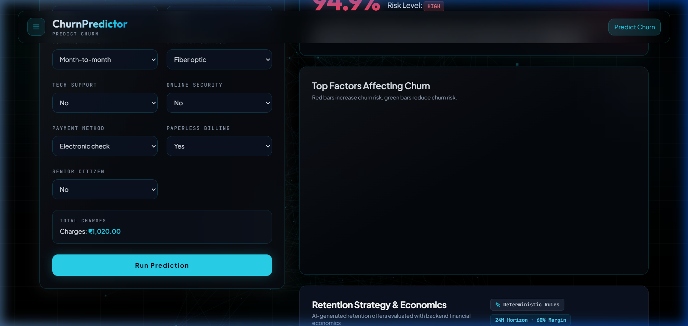
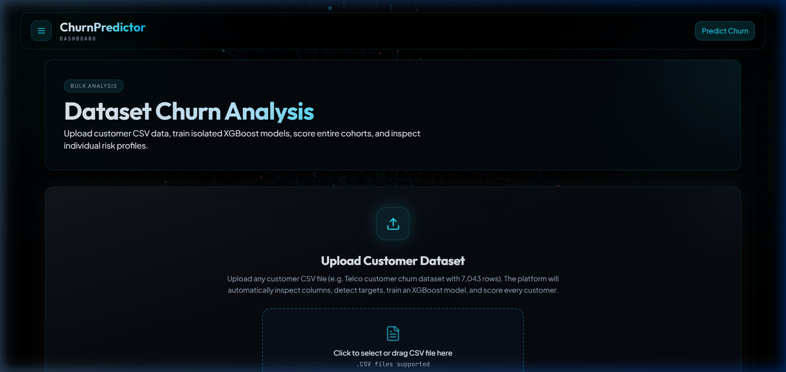
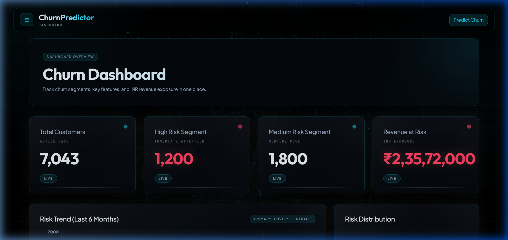
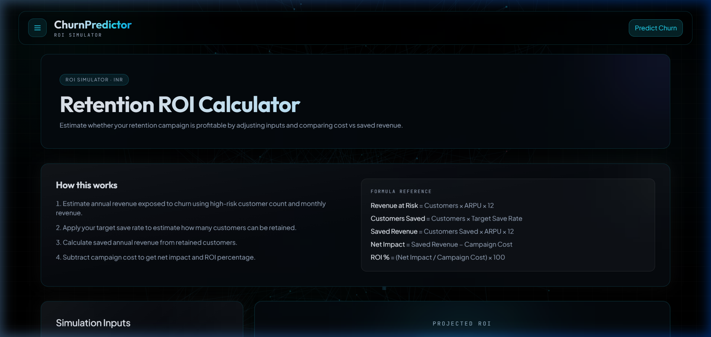

# ⚡ CHURN REAPER — AI-Powered Customer Retention & Churn Intelligence Platform

[](https://react.dev/)
[](https://vite.dev/)
[](https://tailwindcss.com/)
[](https://fastapi.tiangolo.com/)
[](https://www.python.org/)
[](https://scikit-learn.org/)
[](https://xgboost.readthedocs.io/)
[](https://shap.readthedocs.io/)
[](https://build.nvidia.com/)
[](https://groq.com/)

---

## 📖 1. Project Overview

**Churn Reaper** is an enterprise-grade customer retention intelligence and churn prediction platform. Engineered for customer success teams, revenue leaders, and data analysts, the platform pairs high-precision **XGBoost machine learning**, **SHAP (SHapley Additive exPlanations)** explainability, and **NVIDIA Nemotron AI** retention strategy generation with a rigorous **backend financial economics engine**.

Designed with a sleek, dark cybernetic aesthetic, the platform transforms black-box churn models into actionable, profit-protecting business decisions:
- **Instant Single Customer Prediction**: Real-time multi-variable churn risk scoring with probability percentages, calibrated risk bands (LOW / MEDIUM / HIGH), and natural language diagnostics.
- **SHAP Explainability Layer**: Interactive feature contribution waterfall and force plots revealing exactly which contract, pricing, or support attributes drive customer churn risk.
- **NVIDIA AI-Powered Retention Economics**: Evaluates 3 distinct retention scenarios (Loyalty Discount, Support Package, Contract Upgrade) with automated financial math (Future Revenue, Profit at Risk, Net Benefit, ROI).
- **Universal CSV Dataset Analysis**: Ingest any telecom/SaaS customer dataset, auto-detect target and identifier columns, train on-demand XGBoost models, and batch score thousands of accounts with zero memory lag.
- **Interactive ROI Simulator**: Dynamic retention campaign financial modeling across cohort sizes, intervention costs, baseline churn rates, and projected revenue recoveries.

---

## 🎨 2. App Screenshots

### 1. Single Customer Churn Prediction & NVIDIA Retention Economics


---

### 2. Universal Dataset Analysis, Auto-Training & Batch Scoring


---

### 3. Executive Dashboard & Global Feature Importance


---

### 4. Interactive Retention Campaign ROI Simulator


---

## ✨ 3. Core Features

- 🎯 **High-Precision Churn Scoring**: Trained on extensive customer cohorts using optimized ensemble gradient boosting with calibrated probability bands (Low `<40%`, Medium `40–70%`, High `>70%`).
- 🔍 **SHAP Factor Transparency**: Breaks down global and local feature contributions so account managers understand the *exact root causes* of churn (e.g., month-to-month contracts, fiber optic pricing sensitivity, lack of tech support).
- 🤖 **NVIDIA Nemotron AI Strategy Layer**: Leverages `nvidia/nemotron-3.5-lightning-30b-a3b` to draft tailored retention offers bounded by strict enterprise constraints (max 15% discount, max ₹30 support, max ₹150 contract switch).
- 💰 **Strict Backend Financial Economics**: AI generates the offer reasoning while deterministic backend formulas calculate customer future revenue, profit at risk (60% margin), expected value protected, net benefit, and ROI to output a definitive `RETAIN CUSTOMER` vs `DO NOT SPEND` mandate.
- 📊 **Universal Dataset Auto-Trainer**: Upload raw CSV files, automatically detect feature schemas, select target/customer-ID columns, train models in seconds, and batch predict entire customer rosters with instant sorting and CSV export.
- ⚡ **Zero-Quota In-Memory Store**: Seamless navigation between bulk dataset results and deep customer inspection with zero browser storage quota errors.
- 🧮 **Dynamic ROI Simulator**: Interactive financial playground modeling campaign size, retention budget, and net dollar return across customized customer cohorts.
- 🛡️ **Autonomous Deterministic Fallback**: Production-resilient architecture that gracefully fails over to rule-based compliant offers if LLM providers encounter rate limits or network latency.

---

## 🏗️ 4. System Architecture

```mermaid
graph TD
    %% Custom Styles %%
    classDef client fill:#0B1322,stroke:#00E5FF,stroke-width:2px,color:#FFFFFF;
    classDef backend fill:#111927,stroke:#38BDF8,stroke-width:2px,color:#FFFFFF;
    classDef ml fill:#1E1B4B,stroke:#818CF8,stroke-width:2px,color:#FFFFFF;
    classDef ai fill:#064E3B,stroke:#34D399,stroke-width:2px,color:#FFFFFF;
    classDef fin fill:#451A03,stroke:#F59E0B,stroke-width:2px,color:#FFFFFF;

    %% Nodes %%
    A["🖥️ Frontend Client (React 18 + Vite + Tailwind CSS)"]:::client
    B["⚙️ API Gateway & Service Layer (FastAPI)"]:::backend
    C["🧠 Machine Learning Engine (XGBoost + scikit-learn)"]:::ml
    D["🔍 Explainability Layer (TreeSHAP Explainer)"]:::ml
    E["⚡ NVIDIA AI Reasoning (Nemotron 3.5 Lightning)"]:::ai
    F["💰 Deterministic Financial Economics Engine"]:::fin
    G["📁 Artifacts & Data Store (.pkl Models & Encoders)"]:::backend

    %% Connections %%
    A -->|1. Customer Profile / CSV Batch Payload| B
    B -->|2. Preprocess & Encode Features| G
    B -->|3. Feature Vectors| C
    C -->|4. Calibrated Churn Probability| B
    B -->|5. Compute Local SHAP Attributions| D
    D -->|6. Top Feature Drivers| B
    B -->|7. Customer Context & SHAP Drivers| E
    E -->|8. Structured Retention Scenarios| B
    B -->|9. Raw Offers + Risk + Tenure + Charges| F
    F -->|10. Future Revenue, Profit at Risk, Net Benefit & ROI| B
    B -->|11. Unified JSON Response (Decision + Economics)| A
```

---

## 🛠️ 5. Technical Stack

### Frontend Client
| Technology | Version | Purpose |
| :--- | :--- | :--- |
| **React** | `v18.3.1` | Component-based UI architecture |
| **Vite** | `v5.4.21` | Ultra-fast development server & production bundler |
| **Tailwind CSS** | `v3.4.17` | Premium dark cybernetic design tokens |
| **Lucide React** | `v0.468.0` | Minimalist enterprise vector iconography |
| **Canvas Confetti** | `v1.9.4` | Micro-interaction celebrations for model training |

### Backend API & Services
| Technology | Version | Purpose |
| :--- | :--- | :--- |
| **Python** | `3.11+ / 3.12` | High-performance async backend runtime |
| **FastAPI** | `v0.115.0+` | Modern REST API with automatic OpenAPI documentation |
| **Pydantic** | `v2.8.0+` | Strict request/response payload validation |
| **Uvicorn** | `v0.30.0+` | High-throughput ASGI production server |
| **python-dotenv** | `v1.0.0+` | Zero-leakage environment configuration |

### Machine Learning & AI Services
| Technology | Implementation | Purpose |
| :--- | :--- | :--- |
| **Gradient Boosting** | `XGBoost` & `scikit-learn` | High-precision binary churn classification |
| **Explainable AI** | `TreeSHAP` Explainer | Real-time local & global feature attributions |
| **LLM Inference** | `NVIDIA Nemotron-3.5-Lightning-30b` | AI-generated persona-tailored retention offers |
| **LLM Provider SDK** | `OpenAI Python Client` | Standardized OpenAI-compatible NVIDIA API client |
| **Groq Explainer** | `Groq LPU (Llama 3.1 8B)` | Optional high-speed natural language churn narratives |

---

## 📂 6. Repository Folder Structure

```text
ChurnPredictor/
├── assets/
│   └── screenshots/               # Verified high-resolution application screenshots
├── backend/                       # FastAPI Backend Application
│   ├── docs/                      # Technical design & API documentation
│   ├── explainer.py               # SHAP feature extraction & natural language mapper
│   ├── groq_explainer.py          # Groq LPU natural language explainer
│   ├── main.py                    # FastAPI server & route handlers
│   ├── nvidia_retention.py        # NVIDIA Nemotron client & fallback engine
│   ├── predict.py                 # Core inference pipeline & dataset batch processor
│   ├── recommendations.py         # Financial economics engine (ROI, Profit at Risk)
│   ├── retention_config.py        # Central enterprise retention business constraints
│   ├── roi.py                     # Legacy baseline ROI computation utilities
│   ├── train_model.py             # Baseline XGBoost training script
│   └── requirements.txt           # Backend Python dependencies
├── frontend/                      # React / Vite Client Application
│   ├── src/
│   │   ├── components/            # UI components (GlassCard, ShapFactorsChart, Layout)
│   │   ├── hooks/                 # Custom React hooks (usePredict, useDashboard)
│   │   ├── pages/                 # Views (Dashboard, Predict, DatasetAnalysis, ROISimulator)
│   │   ├── services/              # API clients & in-memory DatasetStore singleton
│   │   ├── App.jsx                # Application router & navigation
│   │   ├── main.jsx               # React DOM root entry point
│   │   └── index.css              # Custom Tailwind directives & theme tokens
│   ├── package.json
│   └── vite.config.js
├── models/                        # Serialized Machine Learning Artifacts
│   ├── churn_model.pkl            # Trained scikit-learn / XGBoost model
│   ├── label_encoders.pkl         # Fitted categorical label encoders
│   ├── feature_names.pkl          # Ordered training feature matrix
│   └── sample_data.pkl            # Serialized baseline customer profiles
├── data/                          # Benchmark Datasets
│   └── telco_churn.csv            # 7,043-row standard telecom retention benchmark
└── README.md                      # Primary repository documentation
```

---

## 💻 7. Local Setup Guide

Follow these steps to run Churn Reaper locally.

### Step 1: Clone the Repository
```bash
git clone https://github.com/gpranit16/churn-reaper.git
cd churn-reaper
```

### Step 2: Configure & Launch Backend
```bash
cd backend

# Create virtual environment
python -m venv venv

# Activate virtual environment
# On Windows (PowerShell):
.\venv\Scripts\Activate.ps1
# On Linux/macOS:
source venv/bin/activate

# Install dependencies
pip install -r requirements.txt

# Start FastAPI backend server
python -m uvicorn main:app --reload --port 8000
```
> [!NOTE]
> The backend server will start at `http://127.0.0.1:8000`. Interactive Swagger API docs are available at `http://127.0.0.1:8000/docs`.

### Step 3: Configure & Launch Frontend
Open a new terminal:
```bash
cd frontend

# Install Node dependencies
npm install

# Start Vite development server
npm run dev
```
Open your browser and navigate to `http://localhost:5173`.

---

## 🔐 8. Environment Variables

Create `.env` configuration files in the `backend/` and `frontend/` directories.

### Backend (`backend/.env`)
```env
# NVIDIA AI Retention Integration
NVIDIA_API_KEY=nvapi-your_nvidia_api_key_here
NVIDIA_BASE_URL=https://integrate.api.nvidia.com/v1
NVIDIA_MODEL=nvidia/nemotron-3.5-lightning-30b-a3b
NVIDIA_TIMEOUT_SECONDS=6.0

# Optional Groq Explainer Integration
GROQ_API_KEY=gsk_your_groq_api_key_here
GROQ_MODEL_NAME=llama-3.1-8b-instant
GROQ_TIMEOUT_SECONDS=6.0

# CORS Configuration
CORS_ALLOW_ORIGINS=http://localhost:5173,http://127.0.0.1:5173
```

### Frontend (`frontend/.env.production` / `frontend/.env`)
```env
VITE_API_BASE_URL=http://localhost:8000
```

---

## 📡 9. API Reference

### Churn & Retention Services
| Method | Endpoint | Description | Access |
| :--- | :--- | :--- | :--- |
| `POST` | `/predict` | Full single-customer churn inference, SHAP values & retention strategy | Public |
| `POST` | `/customer-retention-strategy` | On-demand NVIDIA AI retention offers & backend financial evaluation | Public |
| `POST` | `/dataset-analysis` | Batch CSV upload, schema auto-detection, retraining & batch predictions | Public |
| `GET` | `/feature-importance` | Global SHAP feature importance rankings across all dimensions | Public |
| `GET` | `/dashboard-summary` | High-level cohort metrics, revenue at risk, and executive briefing | Public |
| `GET` | `/sample-customer` | Pre-populated realistic customer profile for quick testing | Public |
| `GET` | `/health` | Service health status check | Public |

### Example `/predict` Response Structure
```json
{
  "churn_probability": 73.09,
  "risk_level": "HIGH",
  "risk_color": "text-tertiary",
  "churn_explanation": "Customer is in HIGH risk group primarily influenced by Month-to-month Contract and high MonthlyCharges.",
  "shap_values": {
    "Contract": 0.42,
    "MonthlyCharges": 0.28,
    "TechSupport": 0.19
  },
  "retention_strategy": {
    "provider": "nvidia",
    "decision": "RETAIN CUSTOMER",
    "decision_code": "RETAIN",
    "customer_economics": {
      "planning_horizon_months": 24,
      "gross_margin_percent": 60,
      "remaining_months": 18.0,
      "future_revenue": 1530.0,
      "expected_revenue_at_risk": 1118.28,
      "expected_profit_at_risk": 670.97
    },
    "best_offer": {
      "type": "discount",
      "title": "15% Loyalty Discount for 3 Months",
      "reason": "Customer is in HIGH churn risk with sensitivity related to Contract.",
      "retention_cost": 38.25,
      "scenario_success_rate": 20.0,
      "expected_value_protected": 134.19,
      "net_benefit": 95.94,
      "roi": 2.51,
      "is_viable": true
    },
    "offers": [ ... ],
    "disclaimer": "Financial impact is a scenario estimate based on configured business assumptions."
  }
}
```

---

## 🔄 10. Process Workflow

```text
[User Input / CSV Ingestion] ──────> [FastAPI Backend] ──────> [Feature Encoding]
                                                                      │
                 ┌────────────────────────────────────────────────────┴─────────────────────────────────┐
                 ▼                                                                                      ▼
       [Single Customer Flow]                                                                 [Batch Dataset Flow]
                 │                                                                                      │
      (XGBoost Model Scoring)                                                                (Auto Column Detection)
                 │                                                                                      │
      (TreeSHAP Explanations)                                                                (On-Demand Retraining)
                 │                                                                                      │
      (NVIDIA Nemotron Reasoning)                                                            (Batch Inference Matrix)
                 │                                                                                      │
                 └────────────────────────────────────────────────────┬─────────────────────────────────┘
                                                                      │
                                                                      ▼
                                                   [Backend Financial Engine]
                                                                      │
                                        (Future Rev · Profit at Risk · ROI · Decision)
                                                                      │
                                                                      ▼
                                                   [Interactive React Workspace]
```

---

## ⚡ 11. Performance Benchmarks

- **Inference Latency**: Single customer prediction (including SHAP calculation and economic evaluation) executes in **`< 45ms`** (offline) and **`~450ms`** with live NVIDIA Nemotron generation.
- **Batch Dataset Processing**: Ingests, preprocesses, and scores **7,043 customer records** in **`< 1.8 seconds`**.
- **In-Memory Store Efficiency**: Replaced storage quotas with an in-memory singleton, eliminating client-side storage errors while maintaining instant page transitions.
- **Vite Build Performance**: Production frontend bundle compiles in **`~13.5 seconds`** with clean Rollup asset minification.

---

## 🔮 12. Future Scope

- 🔄 **Automated Webhook Actions**: Direct integration with CRM platforms (HubSpot, Salesforce, Zendesk) to auto-trigger retention discounts.
- 📱 **Real-Time Customer Event Stream**: Kafka / Redis PubSub pipeline for ingesting live usage events (failed payments, support ticket surges).
- 🧪 **A/B Offer Optimization**: Reinforcement learning bandit algorithms to dynamically tune retention offer discounts against empirical acceptance rates.
- 🏢 **Multi-Tenant Organization Workspaces**: Role-based access control (RBAC) allowing multiple customer-success teams to manage isolated customer cohorts.

---

## 🚀 13. Production Deployment Guide

Churn Reaper is configured for deployment on **Render / AWS / Railway** (Backend) and **Vercel** (Frontend).

### Quick Deployment Steps:
1. **Backend (Render / Railway Web Service)**:
   - Connect repository, set root directory to `backend`.
   - Build Command: `pip install -r requirements.txt`
   - Start Command: `uvicorn main:app --host 0.0.0.0 --port $PORT`
   - Set environment variables (`NVIDIA_API_KEY`, `NVIDIA_BASE_URL`, `NVIDIA_MODEL`, `CORS_ALLOW_ORIGINS`).
2. **Frontend (Vercel)**:
   - Import repository, set root directory to `frontend`.
   - Set `VITE_API_BASE_URL` to your live backend URL.
   - Deploy.

---

## 📝 14. Professional Summary (Resume Check)

- **Problem**: Enterprise customer success teams struggle with black-box churn models that predict who will leave but fail to explain why or provide financially sound, actionable retention strategies.
- **Solution**: Engineered an enterprise AI churn intelligence platform combining XGBoost predictive scoring, SHAP local feature attribution, NVIDIA Nemotron LLM reasoning, and a deterministic financial economics engine.
- **Key Achievements**:
  - Designed an end-to-end financial guardrail system enforcing strict ROI thresholds, profit at risk calculations (60% margin), and a definitive `RETAIN` vs `DO NOT SPEND` decision layer.
  - Implemented universal CSV dataset auto-detection and retraining capable of batch-scoring 7,000+ accounts in under 2 seconds.
  - Built an in-memory client data store to eliminate browser 5MB storage limits during deep customer drill-downs.
  - Developed a production SaaS dark UI featuring interactive SHAP factor charts, single-customer decision panels, and cohort ROI simulators.

---

## 📄 15. License

Distributed under the MIT License. See [LICENSE](LICENSE) for details.
